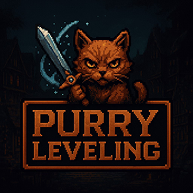

<h1 align="center">PURRY LEVELING - Skill Path Storyline</h1>

  

Purry Leveling adalah game turn-based RPG yang dikembangkan menggunakan prinsip Object-Oriented Programming (OOP) dengan bahasa C++. Website ini merupakan pelengkap dari game utama, dirancang untuk menyajikan eksplorasi naratif dari setiap karakter dan kekuatan yang dimiliki melalui visualisasi skill path dan latar belakang cerita.

## Tujuan Website

Website ini bertujuan untuk:
- Menyampaikan lore dari dunia Purry Leveling
- Menjelaskan asal-usul kekuatan dan skill setiap karakter
- Memberikan pengalaman naratif yang lebih mendalam bagi pemain
- Menyajikan skill tree interaktif untuk masing-masing class

## Konten Utama
1. Intro Dunia & Lore
Setiap kekuatan memiliki cerita. Dalam dunia yang dipenuhi sihir, darah, dan pengkhianatan, tidak ada kekuatan yang muncul begitu saja. Website ini membuka lapisan naratif di balik skill yang tampak sederhana.

2. Class dan Karakter
Pemain dapat menelusuri sejarah dari berbagai class:
- Fighter
- Mage
- Berserker
- Necromancer
- Assassin
  
3. Skill Path
Setiap karakter memiliki jalur perkembangan skill tersendiri, yang ditampilkan dalam bentuk diagram atau visualisasi. Skill tersebut berkaitan erat dengan pengalaman hidup dan nilai-nilai yang dianut karakter tersebut, membentuk alur evolusi yang bermakna.

## Teknologi

Website ini dibangun menggunakan:
- Next.Js untuk tampilan antarmuka
- Desain visual bertema pixel-art untuk konsistensi dengan tampilan game

## Catatan

Website ini dikembangkan sebagai bagian dari Tugas Besar 1 IF2210 - Pemrograman Berorientasi Objek di Institut Teknologi Bandung. Semua konten visual dan cerita dikembangkan secara orisinal untuk memperluas dunia dan makna dari game Purry Leveling.
